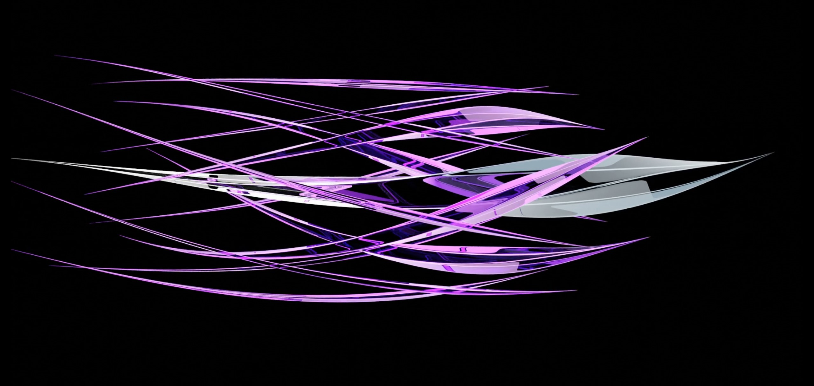
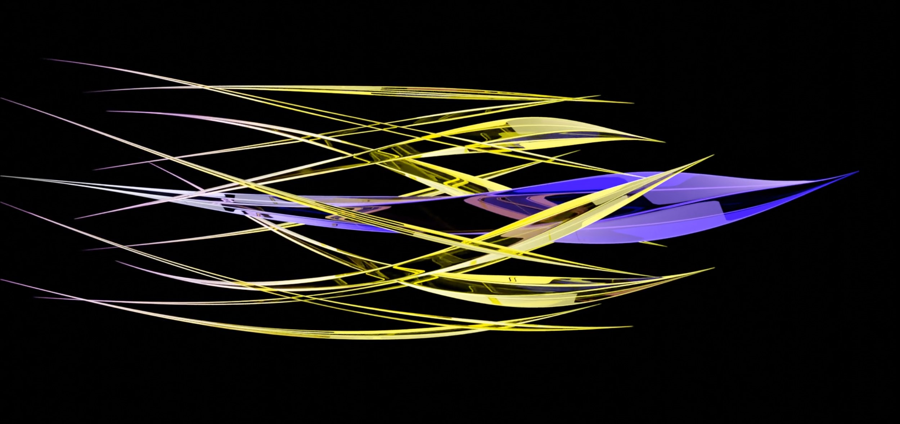
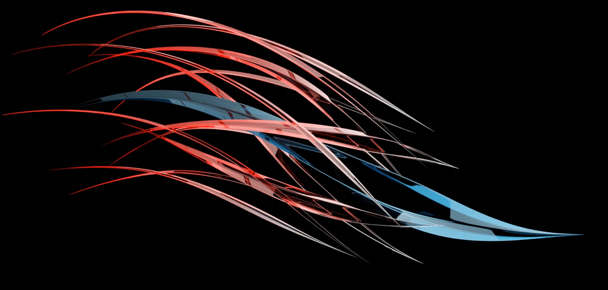
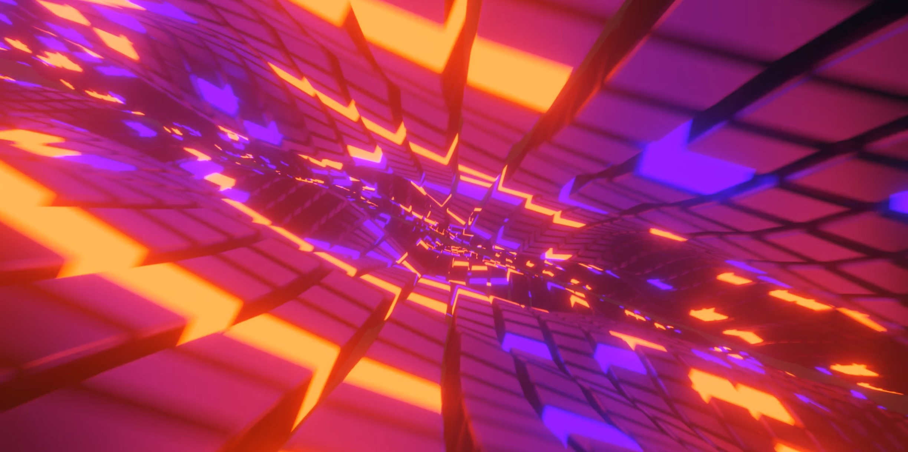
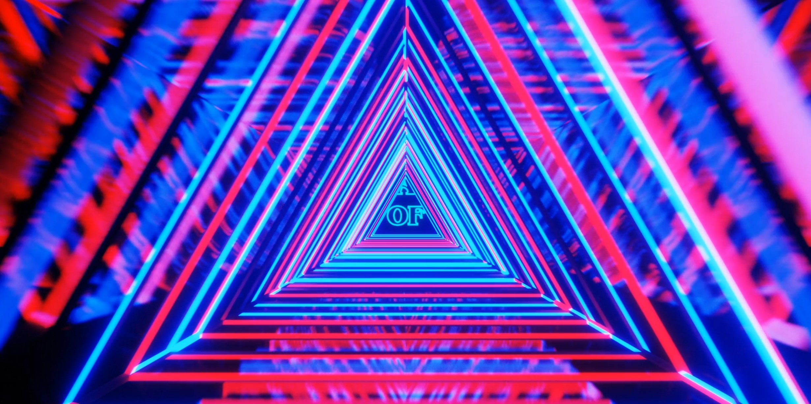
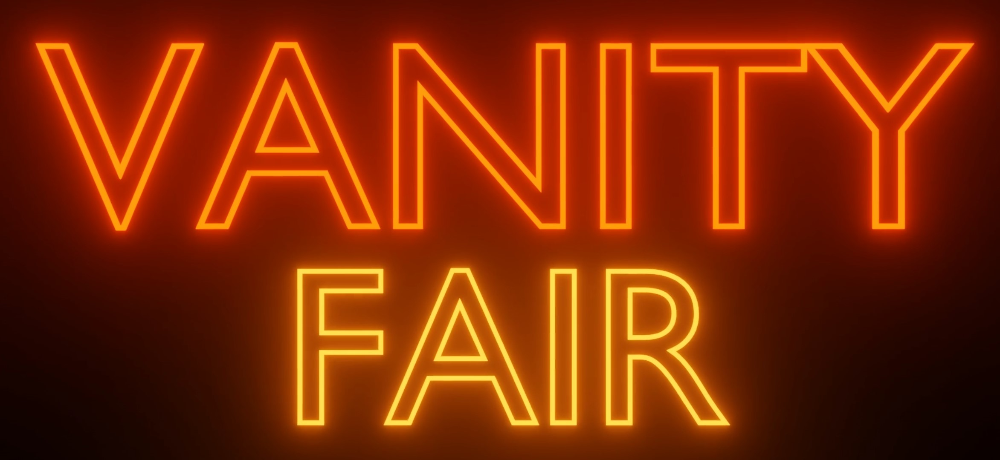

# 🎨 Blender 3D Portfolio

A collection of 3D modeling, animation, and motion graphics projects created in Blender. Featuring photorealistic product renders, abstract motion graphics, and cinematic neon animations.

## 🌟 Portfolio Highlights

### 🍩 Photorealistic Rendering

**Donut Monster Scene**
- Character modeling with detailed textures
- Photorealistic food simulation with sprinkles and icing
- Advanced lighting setup with HDRI environment
- Material creation: glossy chocolate, matte dough, subsurface scattering
- Physically accurate rendering with Cycles


---

### 💎 Abstract Motion Graphics

**Crystal Line Animations**

Dynamic abstract animations featuring intersecting crystalline structures with motion blur and depth of field effects.

**Purple Variant**



https://github.com/user-attachments/assets/crystal2.mov

**Yellow Variant**



https://github.com/user-attachments/assets/crystal3.mov

**Red-Blue Variant**



**Technical Features:**
- Procedural crystal generation
- Motion blur for smooth animation
- Color grading and compositing
- Camera animation with depth of field
- Particle systems for line effects

---

### 🌈 Geometric Tunnel Animations

**Sunset Wave Tunnel**

Organic flowing geometry with warm gradient lighting creating a mesmerizing tunnel effect.



https://github.com/user-attachments/assets/waves.mp4

**Futuristic Triangle Tunnel**

High-speed journey through a neon triangle corridor with chromatic aberration effects.



https://github.com/user-attachments/assets/triangles.mp4

**Technical Features:**
- Array modifiers for geometric patterns
- Camera path animation
- Emission shaders for glowing effects
- Post-processing: bloom, glare, chromatic aberration
- Speed ramping and motion blur

---

### ✨ Neon Typography

**NEON Text Animation**

Realistic neon sign effect with authentic glow, light scatter, and reflections.


https://github.com/user-attachments/assets/neon1.mp4

**VANITY FAIR Text Animation**

Bold neon lettering with atmospheric haze and volumetric lighting.



https://github.com/user-attachments/assets/neon2.mp4

**Technical Features:**
- Emission shaders with custom falloff
- Volumetric fog and light rays
- Bloom and glare effects in compositor
- Realistic glass tube modeling
- HDR lighting setup

---

## 🛠️ Technical Skills

**3D Modeling:**
- Hard surface modeling
- Organic character modeling
- Procedural generation
- UV unwrapping and texturing

**Materials & Shading:**
- PBR (Physically Based Rendering) workflows
- Shader node networks
- Emission materials
- Subsurface scattering
- Glass and transparent materials

**Lighting:**
- HDRI environment lighting
- Three-point lighting setup
- Volumetric lighting
- Area lights and emission objects

**Animation:**
- Keyframe animation
- Camera path animation
- Motion blur
- F-curve editing

**Rendering:**
- Cycles render engine
- EEVEE for real-time previews
- Render optimization
- Sample management

**Post-Processing:**
- Compositor node networks
- Color grading
- Bloom and glare effects
- Chromatic aberration
- Depth of field

## 🎬 Project Details

**Software:** Blender 3.x+  
**Render Engine:** Cycles  
**Resolution:** 1920×1080 (Full HD)  
**Frame Rate:** 24/30 fps  
**Render Times:** 2-10 minutes per frame (depending on complexity)

## 🎯 Creative Process

1. **Concept Development**: Sketch ideas and gather reference images
2. **Modeling**: Create base geometry and refine topology
3. **Materials**: Build shader networks for realistic surfaces
4. **Lighting**: Set up environment and key lights
5. **Animation**: Create camera movements and object animations
6. **Rendering**: Render image sequences or still frames
7. **Post-Processing**: Composite and color grade in Blender or external software

## 📂 File Organization
```
Blender-3D-Portfolio/
├── renders/              # Still frame renders (PNG)
│   ├── donut-monsters.jpg
│   ├── crystal-purple.jpg
│   ├── crystal-yellow.jpg
│   ├── crystal-red.jpg
│   ├── neon-text.jpg
│   ├── triangle-tunnel.jpg
│   ├── sunset-tunnel.jpg
│   └── vanity-fair.jpg
├── crystal2.mov         # Crystal purple animation
├── crystal3.mov         # Crystal yellow animation
├── neon1.mp4           # NEON text animation
├── neon2.mp4           # VANITY FAIR animation
├── triangles.mp4       # Triangle tunnel animation
└── waves.mp4           # Sunset wave tunnel animation
```

## 🌟 Project Themes

**Photorealism** - Showcasing ability to create believable, tangible objects  
**Motion Graphics** - Abstract animations for commercial and artistic use  
**Typography** - Text-based 3D designs with atmospheric effects  
**Color Theory** - Strategic use of color to create mood and impact

## 🎨 Style Influences

- Synthwave / Retrowave aesthetics
- Modern motion graphics
- Product visualization
- Abstract art
- Cinematic lighting

## 💡 Use Cases

These animations and renders are suitable for:
- Music videos and visualizers
- Commercial advertising
- Social media content
- Video game assets
- UI/UX animations
- Title sequences
- Brand identity

---

**Created with Blender** | Showcasing technical proficiency and creative vision in 3D art 🚀
